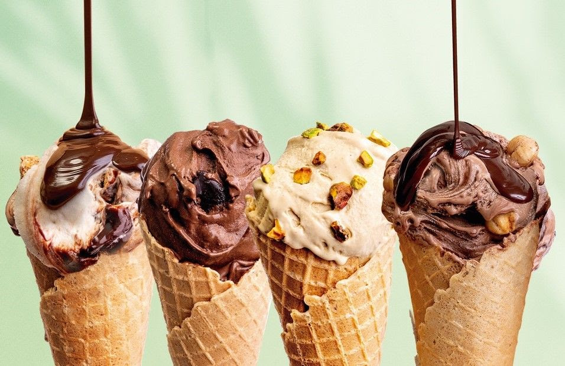
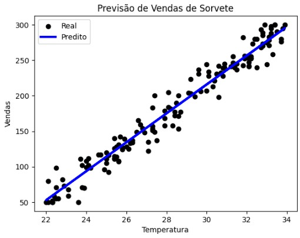

# 🍦 Prevendo Vendas de Sorvete com Machine Learning  
*Projeto: Gelato Mágico*

## 📌 Descrição do Projeto

Neste projeto, utilizamos Machine Learning para ajudar a sorveteria **Gelato Mágico**, localizada em uma cidade litorânea, a **prever o número de sorvetes vendidos com base na temperatura**.

Nosso objetivo foi desenvolver um **modelo de regressão preditiva** simples, funcional e explicável, que permitisse à sorveteria planejar sua produção com mais precisão, **reduzindo desperdícios e maximizando o lucro**.

---

## 🎯 Objetivos

✅ Criar um modelo preditivo baseado na relação entre temperatura e vendas.  
✅ Treinar o modelo utilizando regressão linear.  
✅ Avaliar o desempenho do modelo usando métricas como MAE e MSE.  
✅ Visualizar os resultados e salvar os artefatos via MLflow.  
✅ Estruturar o projeto de forma reprodutível.

---

## 🧠 Cenário

Imagine que em dias mais quentes, a Gelato Mágico vende mais sorvetes. Mas sem planejamento, a produção pode ser insuficiente ou exagerada, o que impacta o lucro.  
Com esse modelo preditivo, será possível prever a demanda diária com base na temperatura prevista, **tomando decisões estratégicas com base em dados**.

---

## 🛠️ Tecnologias Utilizadas

- Python 3.10  
- Pandas, NumPy  
- Scikit-learn  
- Matplotlib  
- MLflow  
- Jupyter Notebook

---

## 📈 Modelo Treinado

Utilizamos o algoritmo **Linear Regression**, que se ajusta bem à correlação direta entre temperatura e número de sorvetes vendidos.  
Abaixo, o gráfico gerado após o treinamento:

---

## 📊 Avaliação do Modelo

A métrica principal utilizada foi o **Erro Médio Absoluto (MAE)**, pois ela nos dá uma estimativa direta e interpretável da margem de erro em unidades de sorvete.

> 📉 **Erro Médio Absoluto (MAE): ~12 sorvetes**  
Isso significa que, em média, o modelo pode errar para **cima ou para baixo em até 12 sorvetes** por dia.

---

## 🔧 Possibilidades de Otimização

O modelo atual usa **apenas a temperatura** como variável preditiva. Algumas melhorias sugeridas para aumentar a precisão incluem:

- 📅 **Adicionar novas variáveis**:
  - Dia da semana (finais de semana têm mais vendas?)
  - Umidade do ar
  - Estação do ano
  - Presença de feriados ou promoções

- 🌲 **Testar modelos mais robustos**:
  - Decision Tree Regressor
  - Random Forest
  - Gradient Boosting (XGBoost, LightGBM)

- 🧪 **Ajustar hiperparâmetros** e avaliar novos modelos com validação cruzada

- 🔁 **Coletar mais dados históricos** para aumentar o poder de generalização do modelo

---

## 🤖 Próximos Passos

- Implementar previsão em tempo real
- Criar uma API de inferência (usando FastAPI ou Flask)
- Subir o modelo para nuvem (Azure, AWS ou GCP)
- Monitorar métricas de performance em produção

---

## 💡 Conclusão

Este projeto foi uma excelente introdução prática aos conceitos de Machine Learning aplicados a um problema real e cotidiano. Mesmo um modelo simples pode oferecer **valor imediato ao negócio**, e com ajustes estratégicos, sua performance pode melhorar ainda mais.

---

## 🚀 Sobre

Este projeto faz parte do desafio da plataforma [DIO.me](https://www.dio.me), integrando conceitos de regressão, MLflow, experimentação e storytelling.  
Sinta-se livre para clonar o repositório, testar e propor melhorias!

---
